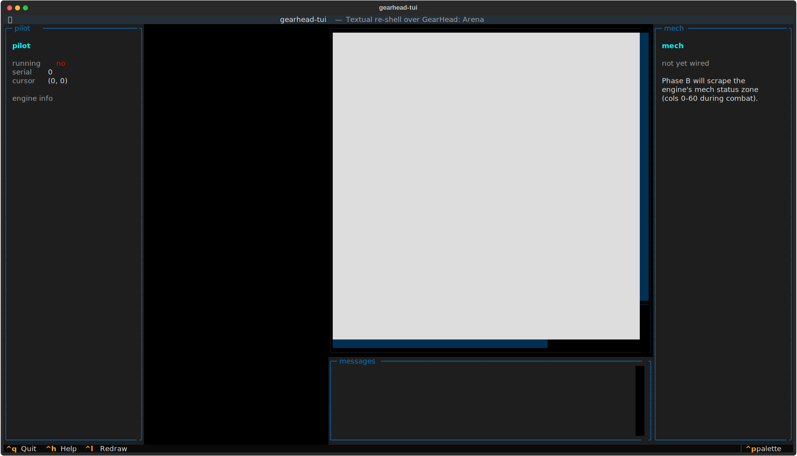
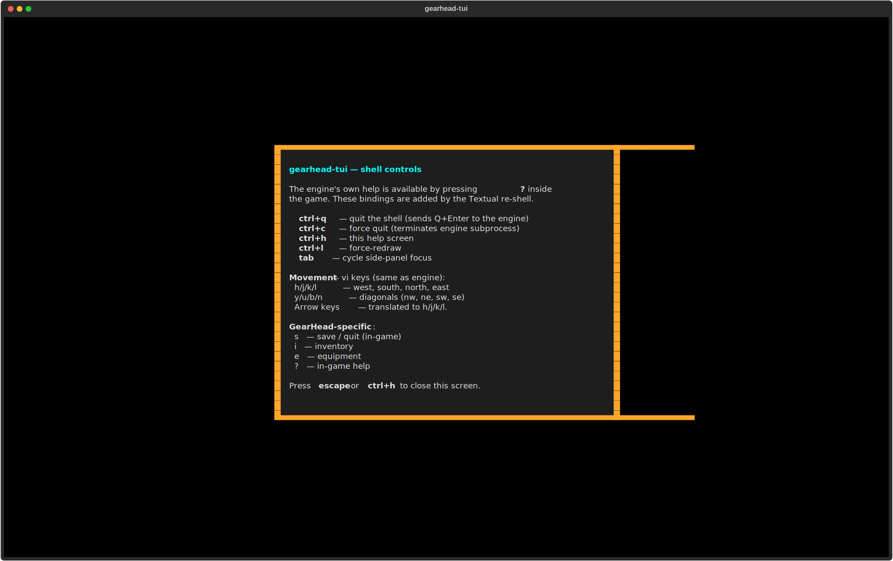

# gearhead-tui
Pilot. Survive. Scavenge.




## About
Earth is dust, the nations are small, and giant combat mechs decide everything. Joseph Hewitt's Free-Pascal GearHead 1 — now wrapped in a modern Textual shell via PTY + pyte with a clean multi-pane layout and REST API. Wander the broken north, scavenge parts, customize your mecha. The real engine beneath. The only way to see the wasteland.

## Screenshots


## Install & Run
```bash
git clone https://github.com/akakabrian/gearhead-tui
cd gearhead-tui
make
make run
```

## Controls
<Add controls info from code or existing README>

## Testing
```bash
make test       # QA harness
make playtest   # scripted critical-path run
make perf       # performance baseline
```

## License
GPL-3.0

## Built with
- [Textual](https://textual.textualize.io/) — the TUI framework
- [tui-game-build](https://github.com/akakabrian/tui-foundry) — shared build process
